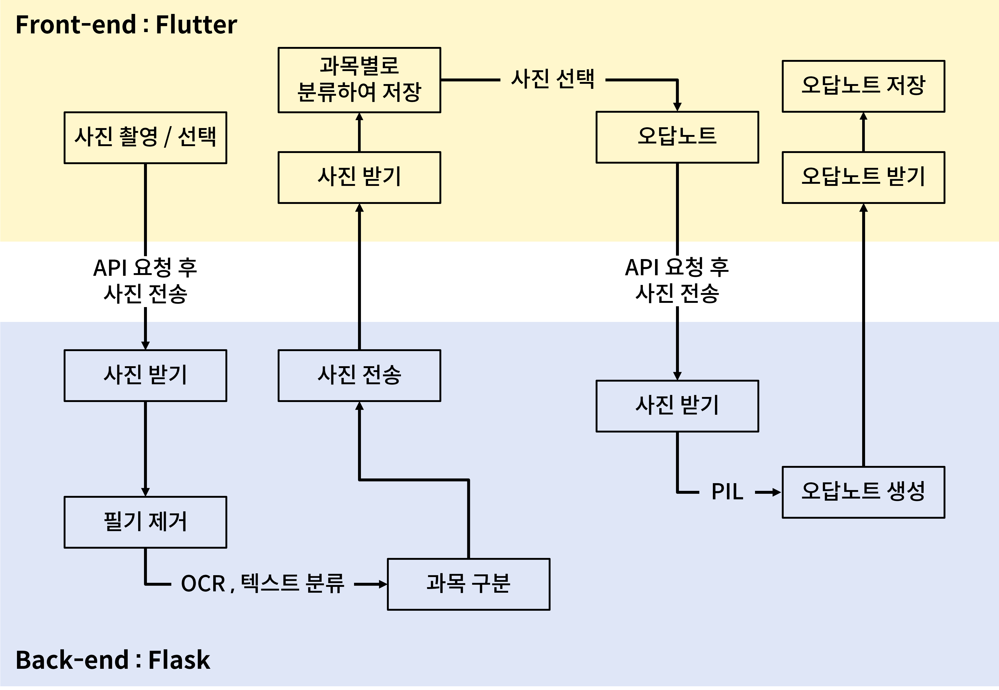

# 안녕하세요
저는 **숭실대학교 AI융합학부**에 재학중인 정인성 입니다.  
제가 제안할 프로젝트는 **필기 제거 기능을 사용한 오답노트 제작 어플** 입니다.  

### 프로젝트 기능
1. 문제를 촬영 또는 업로드 하면 필기를 제거해줌
2. 각 문제를 과목별로 구분하여 각 폴더에 저장해줌
3. 원하는 문제를 고르거나 선택해서 오답노트를 자동으로 생성해줌

### 사용되는 기술
- 필기제거 기능 : 오픈소스 사용 예정
  - GAN알고리즘을 기반으로 작동함
- 문제 내용 추출 : OCR
  - python의 `pytesseract` 라이브러리 사용
- 과목별 문제 분류 : 딥러닝을 이용한 텍스트 분류
  - RNN 기반의 LSTM 모델 사용
- 오답노트 생성 : Python의 `PIL` 라이브러리 사용
- 프론트엔드 : Flutter 사용
  - iOS와 Android 모두에서 사용 가능한 앱 개발 가능
- 백엔드 : Flask
  - API키를 생성하여 프론트엔드와 통신. 주요 기능을 백엔드에서 구현

### 시스템 개요

